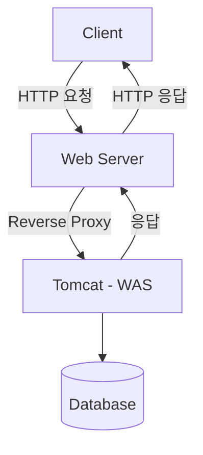

# WS, WAS, Tomcat

## 1. 웹 서버(Web Server, WS)

웹 서버는 정적인 콘텐츠(HTML, CSS, JavaScript 등)를 클라이언트에 제공하는 역할을 합니다. 대표적인 웹 서버로는 Apache HTTP Server와 Nginx가 있습니다.

## 2. WAS(Web Application Server)

WAS는 웹 서버와 연동하여 동적인 콘텐츠를 생성하고, 애플리케이션 로직을 처리합니다. Java 환경에서는 Tomcat, Jetty, WebLogic 등이 대표적입니다.



## 3. Tomcat

Tomcat은 Java Servlet과 JSP를 실행할 수 있는 WAS로, Apache에서 제공하는 오픈소스 서버입니다. 주요 구성 요소는 Catalina(서블릿 컨테이너), Coyote(HTTP Connector), Jasper(JSP 컴파일러)가 있습니다.
```
graph LR;
    Connector[Coyote Connector] --> Engine[Catalina Engine]
    Engine --> Host
    Host --> Context
    Context --> Servlet[Servlet/JSP]

```