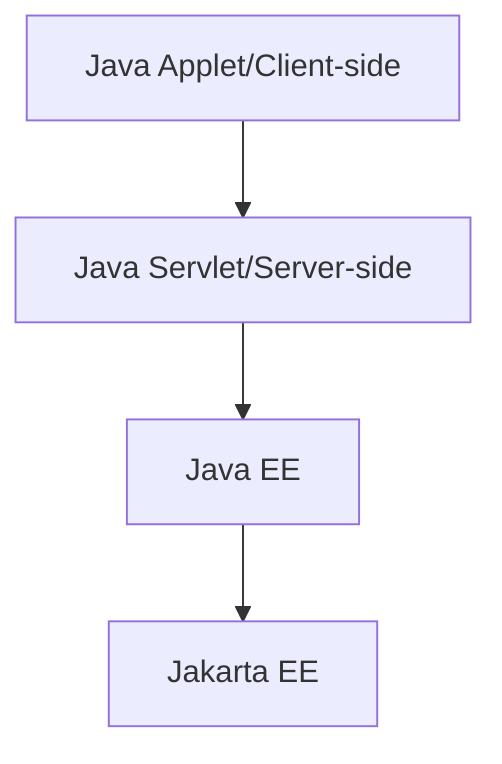
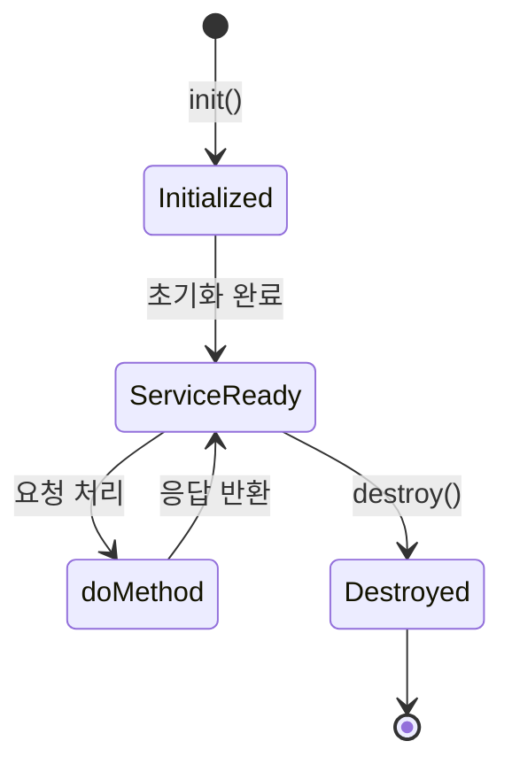

# Servlet

## 1. Servlet이란?

Servlet은 Java 기반의 웹 애플리케이션을 구축하기 위한 서버 사이드 프로그래밍 기술입니다. Servlet은 과거 Java Applet이 클라이언트 측에서 실행되던 것과 달리 서버 측에서 실행되며, Java EE에서 시작되어 현재는 Jakarta EE 프로젝트의 일부로 발전하였습니다.



---

## 2. Servlet의 생애주기(Lifecycle)

Servlet은 다음과 같은 생애주기를 가집니다.



- `init()` : 서블릿이 최초로 로딩될 때 한 번 실행됩니다.
- `service()` : 클라이언트 요청마다 호출되어 doGet, doPost 등의 메서드를 호출합니다.
- `destroy()` : 서버가 종료되거나 서블릿이 제거될 때 호출됩니다.

---

## 3. Servlet 구현 방법

Servlet은 두 가지 방법으로 등록할 수 있습니다.

### 방법 1. web.xml로 Servlet 정의

`web.xml` 파일로 Servlet을 등록하는 방식입니다.

**web.xml**

```xml
<web-app xmlns="https://jakarta.ee/xml/ns/jakartaee"
         xmlns:xsi="http://www.w3.org/2001/XMLSchema-instance"
         xsi:schemaLocation="https://jakarta.ee/xml/ns/jakartaee
                             https://jakarta.ee/xml/ns/jakartaee/web-app_6_0.xsd"
         version="6.0">

    <servlet>
        <servlet-name>HelloServlet</servlet-name>
        <servlet-class>com.example.HelloServlet</servlet-class>
    </servlet>
    <servlet-mapping>
        <servlet-name>HelloServlet</servlet-name>
        <url-pattern>/hello</url-pattern>
    </servlet-mapping>

</web-app>

```

**HelloServlet.java**

```java
package com.example;

import java.io.IOException;
import jakarta.servlet.ServletException;
import jakarta.servlet.http.HttpServlet;
import jakarta.servlet.http.HttpServletRequest;
import jakarta.servlet.http.HttpServletResponse;

public class HelloServlet extends HttpServlet {

    // GET 요청을 처리
    @Override
    protected void doGet(HttpServletRequest req, HttpServletResponse resp)
            throws ServletException, IOException {

        resp.setContentType("text/plain;charset=UTF-8");
        resp.getWriter().println("Hello, Servlet!");
    }
}
```

### 방법 2. 어노테이션 기반 Servlet 정의

어노테이션을 통해 간편하게 Servlet을 등록합니다.

```java
package com.example;

import java.io.IOException;
import jakarta.servlet.ServletException;
import jakarta.servlet.annotation.WebServlet;
import jakarta.servlet.http.HttpServlet;
import jakarta.servlet.http.HttpServletRequest;
import jakarta.servlet.http.HttpServletResponse;

// 어노테이션을 통한 Servlet 매핑
@WebServlet(name = "AnnotationHelloServlet", urlPatterns = "/annohello")
public class AnnotationHelloServlet extends HttpServlet {

    // GET 요청을 처리
    @Override
    protected void doGet(HttpServletRequest req, HttpServletResponse resp)
            throws ServletException, IOException {

        resp.setContentType("text/plain;charset=UTF-8");
        resp.getWriter().println("Hello, Annotation Servlet!");
    }
}

```

---

## 4. doGet, doPost 등 HTTP 메서드 처리

Servlet은 HTTP 메서드에 따라 다양한 `doXXX()` 메서드를 제공합니다.

- `doGet`: 데이터 조회 및 간단한 파라미터 전달에 주로 사용됩니다.
- `doPost`: 데이터 생성, 변경 등 중요한 정보를 전달할 때 주로 사용됩니다.
- 기타: `doPut`, `doDelete`, `doHead`, `doOptions` 등도 존재합니다.

---

## 5. 요청(Request)과 응답(Response)

### 요청 데이터 읽기

Servlet은 요청 시 전달된 데이터(query string 또는 body)를 읽을 수 있습니다.

```java
protected void doGet(HttpServletRequest req, HttpServletResponse resp) throws IOException {
    String name = req.getParameter("name"); // query string 읽기
    resp.setContentType("text/plain;charset=UTF-8");
    resp.getWriter().println("Hello, " + name);
}

```

### JSON 기반 API 서버 예제

Servlet에서 JSON을 처리하는 간단한 예입니다. JSON 처리는 Jackson 라이브러리를 사용합니다.

**pom.xml에 의존성 추가**

```xml
<dependency>
    <groupId>com.fasterxml.jackson.core</groupId>
    <artifactId>jackson-databind</artifactId>
    <version>2.17.0</version>
</dependency>
```

**JsonServlet.java**

```java
@WebServlet("/api/json")
public class JsonServlet extends HttpServlet {

    private final ObjectMapper mapper = new ObjectMapper();

    // POST 요청 시 JSON 데이터를 처리
    @Override
    protected void doPost(HttpServletRequest req, HttpServletResponse resp) throws IOException {
        resp.setContentType("application/json;charset=UTF-8");

        // 요청의 JSON을 User 객체로 변환
        User user = mapper.readValue(req.getInputStream(), User.class);
        user.setMessage("Hello, " + user.getName());

        // User 객체를 JSON으로 응답
        mapper.writeValue(resp.getWriter(), user);
    }

    static class User {
        private String name;
        private String message;

        // getters and setters
    }
}
```

---

## 6. UTF-8 인코딩 이슈

Servlet의 기본 인코딩은 서버 환경마다 다를 수 있습니다. 따라서 UTF-8을 명시적으로 설정하는 것이 좋습니다.
```
req.setCharacterEncoding("UTF-8");
resp.setCharacterEncoding("UTF-8");
resp.setContentType("text/plain;charset=UTF-8");
```